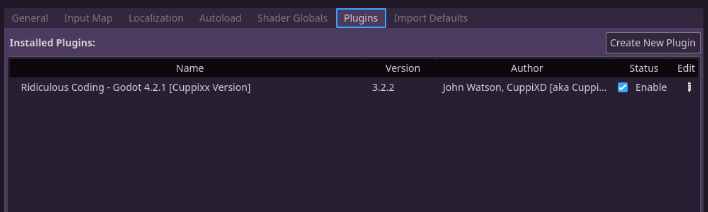

# Ridiculous Coding Addon for Godot 4.X Cuppixx Version

- Original version written by John Watson --> New, improved and **extended** version by Cuppixx.

## Overview

It makes your coding experience in Godot 1000x more ridiculous and

another 1000x more productive.


The original addon was inspired by "[Textreme](https://ash-k.itch.io/textreme-2)" by Ash K. Consider checking it out!

## Changelog, Bugfixes and More ...

As this is a fork of the original addon by John Watson, the general idea and structure remain the same.
Should you encounter any problems (I hope you won't) while using my version of the addon please do not bother the original author as it is most likely an issue caused by me.

### What I fixed
- **Saving works now properly over new / multiple sessions**
- Characters / Keys now animate even with the boom and / or blip settings toggled off
- Fixed some node errors (most likely caused by porting to godot 4)
- Experience is now counted properly after a reload / restart
- More stable in my testing

### What I changed
- **Added an extensive settings window**
- The progress bar now includes different "ranks" to climb
- You can choose between the original beeping sound and my typewriter sound
- Smaller char / blip / newline effects
- Fireworks are now purple-ish instead of rainbow colored
- Chars emited upon destruction are now red / yellow instead of rainbow colored
- Less overhead in code
- Saving now utilizes godots resources instead of .ini files
- Code is more alligned with (godot) writing conventions
- Code is more static
- Prob some more stuff I don't remember as of writing this LOL

### TODO / What I want to do
- Settings to configure VFX color schemes
- Settings to adjust VFX positions
- Implement an optional custom background feature
- Implement a break functionality that reminds you to take a break from coding once in a while

Besides the obvious fix and some new features my version of the addon aims to be less "in your face" type of style. **This is my personal taste**! Feel free to revert any changes back to a more "in your face" type of style.

**A huge thanks** to [John Watson](https://github.com/jotson) for creating such an amazing addon / plugin :D !!!!!!!

## Installation

### AssetLib

1. Launch Godot Engine 4.X
2. Open the AssetLib Tab
3. Search for 'Ridiculous' (that should bring up the addons)
4. Download and Install either my addon or the original
5. From the `res://` directory delete or move the addons LICENSE.md to a designated folder
6. Enable the plugin in `Project Settings | Plugins`

### Manual

1. Download the addon as a zip file
2. Create an `addons` directory in your Godot project
3. Inside of the `addons` directory create an `ridiculous_coding` directory
4. Copy/Paste all files from the zip's `addons/ridiculous_coding` directory into the equivalent projects folder
5. Enable the plugin in `Project Settings | Plugins`

**IMPORTANT:** You might need to close and open (reload) your editor for the plugin to take effect!

Your Godot directory structure should look like this:

```
res://
	addons
		ridiculous_coding
			...all the ridiculous coding files...
```

Remember to activate the addon in your project settings like this:



## About me

#### John Watson

Hey, I'm John and I'm making a game in Godot called [Gravity Ace](https://gravityace.com).

Come follow me on [Twitter](https://twitter.com/yafd) and [wishlist the game on Steam](https://store.steampowered.com/app/1003860/Gravity_Ace/) and [itch.io](https://jotson.itch.io/gravity)!

#### Cuppixx

Hey there, the name is Cuppixx (not my real name, obviously). I like to do game dev stuff, primarily working with Godot Engine. Welcome to my first serious project. I'm quite excited at how many people already checked out this repository and I hope you will enjoy my work.

Currently I have no (active) social media! Still want to follow me? --> Check out my (very much inactive) [Twitch](https://www.twitch.tv/cuppixd)!

## Bibliography

Check out and download the amazing [Godot Engine](https://godotengine.org/download)!

### Cuppixx

[Twitch](https://www.twitch.tv/cuppixd)

[RidiculousCodingCuppixxVersion](https://github.com/Cuppixx/RidiculousCodingCuppixxVersion/tree/main)

[KoalaTime_Take_A_Break](https://github.com/Cuppixx/KoalaTime_Take-A-Break)

More fun links to come ....

### John Watson

[Twitter](https://twitter.com/yafd)

[Gravity Ace](https://gravityace.com)

[Gravity Ace on Steam](https://store.steampowered.com/app/1003860/Gravity_Ace/)

[Gravity Ace on itch.io](https://jotson.itch.io/gravity)

### Reference and Template Sources

| Authors    | Resources   |
| ---------- | ----------- |
| Ash K                            | [Textreme 2](https://ash-k.itch.io/textreme-2)                                   |
| jotson -John Watson-             | [ridiculous_coding](https://github.com/jotson/ridiculous_coding/tree/godot4)     |
| chukusuccess -Chuku Success-     | [Coding-Break-Extension](https://github.com/chukusuccess/Coding-Break-Extension) |
| Nukiloco                         | [editor_background](https://github.com/Nukiloco/editor_background)               |
| newjoker6 -Michael McGuire-      | [Editor-Image-Plugin-2](https://github.com/newjoker6/Editor-Image-Plugin-2)      |
